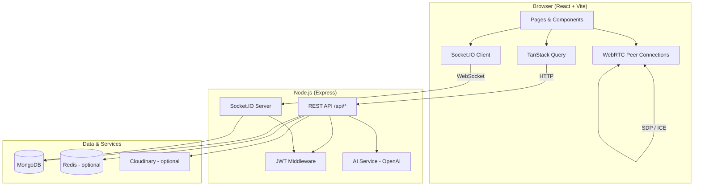

<div align="center">

# IntellMeet

**AI-powered enterprise meeting and collaboration platform**

Turn every meeting into actionable outcomes — real-time video, live transcription, AI summaries, team workspaces, and analytics in one stack.

[](https://nodejs.org/)
[](https://react.dev/)
[](https://www.typescriptlang.org/)
[](https://www.mongodb.com/)
[](https://socket.io/)
[](LICENSE)

[Features](#-features) · [Quick Start](#-quick-start) · [Configuration](#-configuration) · [API](#-api-reference) · [Docker](#-docker) · [Contributing](#-contributing)

</div>

---

## Table of contents

- [Overview](#overview)
- [Features](#-features)
- [Tech stack](#-tech-stack)
- [Architecture](#-architecture)
- [Prerequisites](#-prerequisites)
- [Quick start](#-quick-start)
- [Configuration](#-configuration)
- [Demo account](#-demo-account)
- [Project structure](#-project-structure)
- [Available scripts](#-available-scripts)
- [API reference](#-api-reference)
- [Real-time events](#-real-time-events-socketio)
- [Testing](#-testing)
- [Docker](#-docker)
- [Production deployment](#-production-deployment)
- [Security](#-security)
- [Troubleshooting](#-troubleshooting)
- [Contributing](#-contributing)
- [License](#-license)

---

## Overview

**IntellMeet** is a full-stack MERN application for modern remote teams. Host HD video meetings over WebRTC, collaborate with in-meeting chat and shared notes, capture live transcripts, and let AI generate summaries and action items when a session ends. Organize work in team workspaces with Kanban boards, track metrics on an analytics dashboard, and manage users from an admin panel.

| Layer    | Path      | Description                                      |
| -------- | --------- | ------------------------------------------------ |
| Frontend | `client/` | React 19 + Vite + Tailwind CSS 4                 |
| Backend  | `server/` | Express + MongoDB + Socket.IO + optional Redis   |

**Live URLs (local development)**

| Service   | URL                              |
| --------- | -------------------------------- |
| Web app   | http://localhost:5173            |
| REST API  | http://localhost:5000            |
| Health    | http://localhost:5000/api/health |
| Metrics   | http://localhost:5000/metrics    |

---

## ✨ Features

### Meetings & video

- **WebRTC video calls** — peer-to-peer HD video with signaling over Socket.IO
- **Room codes** — join meetings via shareable codes (e.g. `DEMO1234`)
- **Screen sharing** — broadcast your screen to participants in real time
- **In-meeting chat** — persistent chat history synced to MongoDB
- **Shared notes** — collaborative notes with live sync across participants
- **Live transcription** — speech-to-text chunks appended to the meeting transcript
- **Recording upload** — save meeting recordings (local disk or Cloudinary CDN)
- **Meeting lifecycle** — schedule, go live, end session, export transcript/summary

### AI & productivity

- **AI meeting summaries** — powered by OpenAI (`gpt-4o-mini`) when `OPENAI_API_KEY` is set
- **Action item extraction** — automatic tasks with optional assignee hints
- **Mock AI fallback** — works without an API key for demos and development
- **Quick tasks** — create tasks from a meeting directly into team projects
- **Export** — download meeting data as structured export

### Teams & collaboration

- **Team workspaces** — create teams and invite members
- **Projects & Kanban** — boards with drag-and-drop task columns (`todo` → `in_progress` → `done`)
- **Real-time board updates** — Socket.IO project rooms for live task sync

### Platform

- **JWT authentication** — access + refresh tokens with HTTP-only cookies
- **Google OAuth** — optional one-click sign-in (Google Identity Services)
- **Role-based access** — `admin` and `member` roles
- **Notifications** — in-app notification center with read/unread state
- **Analytics dashboard** — meeting stats, trends, CSV export
- **Admin panel** — user management, role changes, platform statistics
- **Observability** — Prometheus metrics endpoint (`/metrics`)
- **Rate limiting** — auth endpoints protected against brute force
- **Docker-ready** — multi-stage build serves API + static frontend on one port

---

## 🛠 Tech stack

### Frontend (`client/`)

| Technology        | Purpose                          |
| ----------------- | -------------------------------- |
| React 19          | UI framework                     |
| Vite 6            | Dev server & production build  |
| TypeScript        | Type safety                      |
| Tailwind CSS 4    | Styling                          |
| React Router 7    | Client-side routing              |
| TanStack Query    | Server state & caching           |
| Zustand           | Auth & global client state       |
| Socket.IO Client  | Real-time meetings & boards      |
| Lucide React      | Icons                            |

### Backend (`server/`)

| Technology        | Purpose                          |
| ----------------- | -------------------------------- |
| Node.js 20+       | Runtime                          |
| Express 4         | REST API                         |
| TypeScript        | Type safety                      |
| MongoDB + Mongoose| Primary database                 |
| Socket.IO 4       | WebRTC signaling, chat, sync     |
| Redis (optional)  | Caching layer                    |
| JWT + bcrypt      | Authentication                   |
| Zod               | Request validation               |
| OpenAI API        | Meeting analysis                 |
| Cloudinary        | Avatar & recording CDN (optional)|
| Prometheus        | Metrics (`prom-client`)          |
| Vitest            | Unit tests                       |

---

## 🏗 Architecture



**Request flow (meeting room)**

1. User authenticates via REST → receives JWT access token.
2. Client connects to Socket.IO with token in `auth`.
3. User joins room → server tracks participants and loads chat/notes history.
4. WebRTC offers/answers/ICE candidates relay through Socket.IO.
5. Chat, notes, and transcript chunks persist to MongoDB in real time.
6. Host ends meeting → server runs AI analysis on transcript → summary & action items saved.

---

## 📋 Prerequisites

| Requirement | Version / notes                                      |
| ----------- | ---------------------------------------------------- |
| **Node.js** | 20.x or later ([download](https://nodejs.org/))      |
| **npm**     | 10+ (ships with Node.js)                             |
| **MongoDB** | 7.x local, Atlas, or via Docker Compose              |
| **Redis**   | Optional — improves caching; app runs without it     |
| **OpenAI**  | Optional — enables real AI summaries                 |
| **Google Cloud** | Optional — OAuth client ID for Google sign-in |
| **Cloudinary**   | Optional — CDN for avatars and recordings      |

---

## 🚀 Quick start

### 1. Clone the repository

```bash
git clone https://github.com/Manthan3888/intellmeet.git
cd intellmeet
```

### 2. Start MongoDB (choose one)

**Option A — Docker (recommended)**

```bash
cd server
docker compose up mongo redis -d
```

**Option B — Local MongoDB**

Ensure MongoDB is running on `mongodb://localhost:27017`.

### 3. Configure environment

```bash
# Server
cd server
cp .env.example .env
# Edit server/.env — at minimum set JWT secrets

# Client
cd ../client
cp .env.example .env
# VITE_SOCKET_URL defaults to http://localhost:5000
```

### 4. Install dependencies

```bash
cd server && npm install
cd ../client && npm install
```

### 5. Seed demo data (optional)

```bash
cd server
npm run seed
```

### 6. Run the application

**Option A — Two terminals (recommended for development)**

```bash
# Terminal 1 — API
cd server && npm run dev

# Terminal 2 — Frontend
cd client && npm run dev
```

**Option B — Single command from server**

```bash
cd server && npm run dev:all
```

Open **http://localhost:5173** and sign in with the [demo account](#-demo-account) or create a new user.

---

## ⚙ Configuration

### Server environment (`server/.env`)

Copy from `server/.env.example`:

```bash
cp server/.env.example server/.env
```

| Variable               | Required | Default                              | Description |
| ---------------------- | -------- | ------------------------------------ | ----------- |
| `PORT`                 | No       | `5000`                               | HTTP port for the API |
| `NODE_ENV`             | No       | `development`                        | `development` \| `production` |
| `MONGO_URI`            | **Yes**  | `mongodb://localhost:27017/intellmeet` | MongoDB connection string |
| `JWT_ACCESS_SECRET`    | **Yes**  | —                                    | Secret for short-lived access tokens |
| `JWT_REFRESH_SECRET`   | **Yes**  | —                                    | Secret for refresh tokens |
| `CLIENT_URL`           | **Yes**  | `http://localhost:5173`              | Frontend origin (CORS & cookies) |
| `REDIS_URL`            | No       | `redis://localhost:6379`             | Redis URL; omitted = in-memory fallback |
| `OPENAI_API_KEY`       | No       | —                                    | Enables GPT-powered summaries |
| `GOOGLE_CLIENT_ID`     | No       | —                                    | Google OAuth client ID (server verification) |
| `CLOUDINARY_CLOUD_NAME`| No       | —                                    | Cloudinary cloud name |
| `CLOUDINARY_API_KEY`   | No       | —                                    | Cloudinary API key |
| `CLOUDINARY_API_SECRET`| No       | —                                    | Cloudinary API secret |

> **Production:** Use long, random values for `JWT_ACCESS_SECRET` and `JWT_REFRESH_SECRET`. Never commit `.env` files.

### Client environment (`client/.env`)

Copy from `client/.env.example`:

```bash
cp client/.env.example client/.env
```

| Variable              | Required | Default                    | Description |
| --------------------- | -------- | -------------------------- | ----------- |
| `VITE_API_URL`        | No       | *(empty = same origin)*    | API base URL; leave empty in dev (Vite proxy) |
| `VITE_SOCKET_URL`     | No       | `http://localhost:5000`    | Socket.IO server URL |
| `VITE_GOOGLE_CLIENT_ID` | No     | —                          | Google sign-in button (must match server `GOOGLE_CLIENT_ID`) |

### Google OAuth setup (optional)

1. Create a project in [Google Cloud Console](https://console.cloud.google.com/).
2. Enable **Google Identity Services** / OAuth 2.0 credentials.
3. Add authorized JavaScript origins: `http://localhost:5173` (and your production domain).
4. Set `GOOGLE_CLIENT_ID` in `server/.env` and `VITE_GOOGLE_CLIENT_ID` in `client/.env`.

### OpenAI setup (optional)

1. Create an API key at [platform.openai.com](https://platform.openai.com/).
2. Set `OPENAI_API_KEY` in `server/.env`.
3. End a meeting with a non-empty transcript to trigger AI analysis.

Without OpenAI, the server returns **mock summaries** so the full flow remains testable.

---

## 🎮 Demo account

After running `npm run seed` in `server/`:

| Field      | Value                    |
| ---------- | ------------------------ |
| **Email**  | `demo@intellmeet.com`    |
| **Password** | `demo1234`             |
| **Role**   | `admin`                  |
| **Room code** | `DEMO1234` (sample live meeting) |

Additional seeded user: `alex@intellmeet.com` / `demo1234` (member).

---

## 📁 Project structure

```
intellmeet/
├── client/                    # React frontend
│   ├── public/
│   ├── src/
│   │   ├── components/        # UI, layout, auth guards
│   │   ├── hooks/           # useMeetingRoom, useLiveTranscription
│   │   ├── lib/             # API client, utilities
│   │   ├── pages/           # Route-level views
│   │   └── store/           # Zustand auth store
│   ├── .env.example
│   └── package.json
│
├── server/                    # Express API
│   ├── src/
│   │   ├── config/          # Env, DB, Redis
│   │   ├── middleware/      # Auth, metrics, validation, errors
│   │   ├── models/          # User, Meeting, Team schemas
│   │   ├── routes/          # REST endpoints
│   │   ├── services/        # AI, uploads, Google auth
│   │   ├── socket/          # Real-time meeting & project events
│   │   ├── scripts/         # Database seed
│   │   └── index.ts         # App entry point
│   ├── tests/
│   ├── Dockerfile
│   ├── docker-compose.yml
│   └── package.json
│
├── .gitignore
└── README.md
```

### Application routes (frontend)

| Path                      | Access    | Description              |
| ------------------------- | --------- | ------------------------ |
| `/`                       | Public    | Landing page             |
| `/login`, `/signup`       | Public    | Authentication           |
| `/dashboard`              | Protected | Overview & quick actions   |
| `/meetings`               | Protected | List & create meetings     |
| `/meetings/:id`           | Protected | Meeting details & AI output|
| `/meetings/room/:roomCode`| Protected | Live video room          |
| `/teams`                  | Protected | Teams, projects, Kanban    |
| `/analytics`              | Protected | Charts & CSV export        |
| `/notifications`          | Protected | Notification inbox         |
| `/profile`                | Protected | Profile & avatar           |
| `/admin`                  | Admin     | User & platform management |

---

## 📜 Available scripts

### Server (`server/`)

| Command           | Description                                      |
| ----------------- | ------------------------------------------------ |
| `npm run dev`     | Start API with hot reload (`tsx watch`)          |
| `npm run dev:all` | Start API + client concurrently                  |
| `npm run build`   | Compile TypeScript to `dist/`                    |
| `npm run start`   | Run production build                             |
| `npm run seed`    | Reset DB and insert demo data                    |
| `npm run test`    | Run Vitest unit tests                            |
| `npm run test:watch` | Vitest in watch mode                          |

### Client (`client/`)

| Command           | Description                                      |
| ----------------- | ------------------------------------------------ |
| `npm run dev`     | Vite dev server on port 5173                     |
| `npm run build`   | Typecheck + production bundle to `dist/`         |
| `npm run preview` | Preview production build locally                 |

---

## 📡 API reference

Base URL: `http://localhost:5000/api`

All protected routes require header: `Authorization: Bearer <access_token>`

### Auth — `/api/auth`

| Method | Endpoint    | Auth | Description                |
| ------ | ----------- | ---- | -------------------------- |
| POST   | `/signup`   | No   | Register new user          |
| POST   | `/login`    | No   | Login, returns tokens      |
| POST   | `/refresh`  | No   | Refresh access token       |
| POST   | `/logout`   | Yes  | Invalidate refresh token   |
| GET    | `/me`       | Yes  | Current user profile       |
| POST   | `/google`   | No   | Google ID token login      |

### Users — `/api/users`

| Method | Endpoint   | Description              |
| ------ | ---------- | ------------------------ |
| PATCH  | `/profile` | Update name, etc.        |
| POST   | `/avatar`  | Upload profile picture   |
| GET    | `/search`  | Search users by query    |

### Meetings — `/api/meetings`

| Method | Endpoint              | Description                    |
| ------ | --------------------- | ------------------------------ |
| GET    | `/`                   | List user's meetings           |
| POST   | `/`                   | Create meeting                 |
| GET    | `/join/:roomCode`     | Preview room before join       |
| POST   | `/join/:roomCode`     | Join meeting by code           |
| GET    | `/:id`                | Meeting details                |
| POST   | `/:id/end`            | End meeting + AI analysis      |
| GET    | `/:id/export`         | Export meeting data            |
| POST   | `/:id/recording`      | Upload recording file          |
| PATCH  | `/:id/action-items/:itemId` | Toggle action item complete |
| POST   | `/:id/create-tasks`   | Push action items to Kanban    |
| POST   | `/:id/quick-task`     | Create single task from meeting|
| DELETE | `/:id`                | Delete meeting                 |

### Teams — `/api/teams`

| Method | Endpoint                        | Description           |
| ------ | ------------------------------- | --------------------- |
| GET    | `/`                             | List teams            |
| POST   | `/`                             | Create team           |
| POST   | `/:id/members`                  | Add member            |
| GET    | `/:id/projects`                 | List projects         |
| POST   | `/:id/projects`                 | Create project        |
| GET    | `/projects/:projectId/tasks`    | List tasks            |
| POST   | `/projects/:projectId/tasks`    | Create task           |
| PATCH  | `/tasks/:taskId`                | Update task           |
| DELETE | `/tasks/:taskId`                | Delete task           |

### Analytics — `/api/analytics`

| Method | Endpoint     | Description              |
| ------ | ------------ | ------------------------ |
| GET    | `/dashboard` | Dashboard metrics        |
| GET    | `/export`    | Export analytics CSV     |

### Notifications — `/api/notifications`

| Method | Endpoint      | Description           |
| ------ | ------------- | --------------------- |
| GET    | `/`           | List notifications    |
| PATCH  | `/:id/read`   | Mark one as read      |
| POST   | `/read-all`   | Mark all as read      |

### Admin — `/api/admin` *(admin role only)*

| Method | Endpoint          | Description        |
| ------ | ----------------- | ------------------ |
| GET    | `/stats`          | Platform statistics|
| GET    | `/users`          | List all users     |
| PATCH  | `/users/:id/role` | Change user role   |

### System

| Method | Endpoint       | Description                    |
| ------ | -------------- | ------------------------------ |
| GET    | `/api/health`  | Health check + live meeting count |
| GET    | `/metrics`     | Prometheus metrics             |

---

## 🔌 Real-time events (Socket.IO)

Connect with authentication:

```javascript
import { io } from 'socket.io-client';

const socket = io('http://localhost:5000', {
  auth: { token: accessToken },
});
```

### Meeting room events

| Event (client → server)   | Description                          |
| ------------------------- | ------------------------------------ |
| `join-room`               | Join meeting by `roomCode`           |
| `leave-room`              | Leave current room                   |
| `webrtc-offer`            | Forward SDP offer to peer            |
| `webrtc-answer`           | Forward SDP answer to peer           |
| `webrtc-ice-candidate`    | Forward ICE candidate to peer        |
| `chat-message`            | Send chat message                    |
| `typing`                  | Typing indicator                     |
| `media-state`             | Mute / video on-off state            |
| `transcript-chunk`        | Append live transcription            |
| `notes-update`            | Update shared notes                  |
| `screen-share-started`    | Notify screen share started          |
| `screen-share-stopped`    | Notify screen share stopped          |

| Event (server → client)   | Description                          |
| ------------------------- | ------------------------------------ |
| `room-participants`       | Current participant list             |
| `user-joined` / `user-left` | Participant join/leave             |
| `chat-message`            | New chat message                     |
| `chat-history`            | Last 50 messages on join             |
| `live-transcript`         | Live transcript line                 |
| `notes-sync`              | Shared notes update                  |
| `participant-media-update`| Peer mute/video state                |
| `user-typing`             | Typing indicator from peer           |

### Project board events

| Event                     | Description                          |
| ------------------------- | ------------------------------------ |
| `join-project`            | Subscribe to `project:{id}` updates  |

---

## 🧪 Testing

```bash
cd server
npm run test
```

Tests live in `server/tests/` (Vitest). Example: utility and helper unit tests.

---

## 🐳 Docker

Full stack (MongoDB, Redis, API + built frontend) from the `server` directory:

```bash
cd server

# Set secrets (or use defaults for local demo)
export JWT_ACCESS_SECRET=your-access-secret
export JWT_REFRESH_SECRET=your-refresh-secret
export OPENAI_API_KEY=sk-...   # optional

docker compose up --build
```

| Service | Port  |
| ------- | ----- |
| App     | 5000  |
| MongoDB | 27017 |
| Redis   | 6379  |

Production build serves the React app from the same origin as the API (`http://localhost:5000`).

**Infrastructure only** (run API locally):

```bash
docker compose up mongo redis -d
cd server && npm run dev
```

---

## 🚢 Production deployment

1. **Build the client**

   ```bash
   cd client && npm run build
   ```

2. **Build & start the server** — the server auto-serves `client/dist` when `NODE_ENV=production` and the folder exists.

   ```bash
   cd server && npm run build && npm run start
   ```

3. **Or use Docker** — see [Docker](#-docker). The `Dockerfile` multi-stage build compiles both client and server.

4. **Environment checklist**
   - Set strong `JWT_*` secrets
   - Point `MONGO_URI` to managed MongoDB (e.g. Atlas)
   - Set `CLIENT_URL` to your production frontend URL
   - Configure `REDIS_URL` for production caching
   - Add `OPENAI_API_KEY`, `GOOGLE_CLIENT_ID`, and Cloudinary as needed
   - Put the app behind HTTPS (reverse proxy: Nginx, Caddy, or cloud load balancer)

5. **WebRTC note** — production video may require TURN/STUN configuration for users behind strict NATs; the current implementation uses browser defaults suitable for development and same-network testing.

---

## 🔒 Security

- Passwords hashed with **bcrypt** (cost factor 12)
- **JWT** access tokens + HTTP-only refresh cookies
- **Helmet** security headers on Express
- **CORS** restricted to `CLIENT_URL`
- **Rate limiting** on auth routes
- Input **sanitization** on chat, notes, and transcripts
- **Zod** schema validation on request bodies
- Secrets and `.env` files are **gitignored** — never commit credentials

Report security issues privately to the repository owner.

---

## 🩺 Troubleshooting

| Issue | Solution |
| ----- | -------- |
| `ECONNREFUSED` to MongoDB | Start MongoDB or run `docker compose up mongo -d` |
| CORS errors in browser | Ensure `CLIENT_URL` in `server/.env` matches your Vite URL (`http://localhost:5173`) |
| Socket connection fails | Check `VITE_SOCKET_URL` points to the API (`http://localhost:5000`) |
| Google sign-in disabled | Set matching `GOOGLE_CLIENT_ID` / `VITE_GOOGLE_CLIENT_ID` |
| AI summary is generic | Add `OPENAI_API_KEY`; ensure meeting has transcript text before ending |
| Redis warnings | Optional — app works without Redis; set `REDIS_URL` or ignore warnings |
| Port 5000 in use | Change `PORT` in `server/.env` and update `VITE_SOCKET_URL` |

---

## 🤝 Contributing

Contributions are welcome.

1. Fork the repository
2. Create a feature branch: `git checkout -b feature/amazing-feature`
3. Commit your changes: `git commit -m 'Add amazing feature'`
4. Push to the branch: `git push origin feature/amazing-feature`
5. Open a Pull Request

Please keep PRs focused, follow existing code style, and do not commit `.env` files.

---

## 📄 License

This project is licensed under the **MIT License** — see the [LICENSE](LICENSE) file for details.

---

## 👤 Author

**Manthan Rajani**

- GitHub: [@Manthan3888](https://github.com/Manthan3888)
- Repository: [github.com/Manthan3888/intellmeet](https://github.com/Manthan3888/intellmeet)

---

<div align="center">

Built with ❤️ for modern remote teams · **Zidio Development Portfolio Project**

⭐ Star this repo if you find it useful!

</div>
